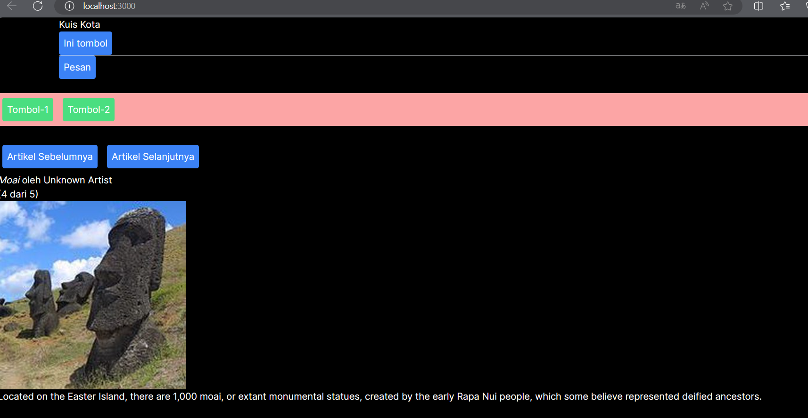

Nama : Muhammad Ali Reza  
NIM : 2041720182  
Kelas : TI 3F  

## Praktikum 4

1. Akan terjadi error dengan detail sebagai berikut

 

2.Hasil Setelah di modifikasi

 

3.Menambah tombol Artikel sebelumnya

 
Hasil Run

 

## Praktikum 5
Yang terjadi terdapat form yang jika di isi maka tombol submit bisa digunakan

1. Perbedaan fungsinya menggunakan useState untuk mengatur state dari firstName, lastName, dan fullName, lalu pada Form_2 yang kedua kita menghapus useState pada fullName karena menyebabkan state redundan

2.Karena fullName adalah derived state dari firstName dan lastName, maka kita tidak perlu menyimpannya dalam state. Kita bisa secara langsung dari firstName dan lastName ketika kita membutuhkannya.

Keuntungannya adalah mengurangi redundansi data dan memastikan bahwa fullName selalu sinkron dengan firstName dan lastName

